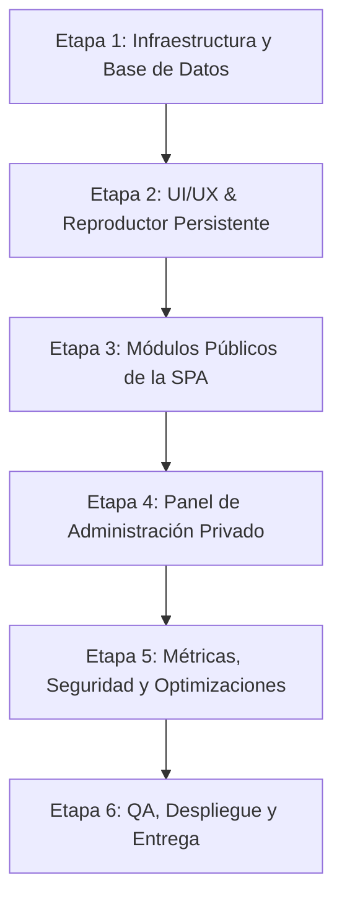

# Plan General de Desarrollo y Evaluación Técnica: angelgiolitti.com.ar

**Cliente:** Ángel Giolitti  
**Desarrollador / Estudio:** OVNI Studio — Emilio Marchi  
**Fecha:** Julio de 2026  
**Enfoque:** Single Page Application (SPA) multimedia estilo Spotify con Reproductor Persistente de Audio e Infraestructura de Costo $0/mes.

---

## 1. Evaluación de Decisiones Técnicas y Recomendaciones

Tras analizar detenidamente el documento base (`base-proyect.md`), se evalúan las decisiones arquitectónicas propuestas y se sugieren optimizaciones clave para garantizar solidez, velocidad y facilidad de mantenimiento.

### 1.1 Stack Frontend: Next.js (App Router) vs. React + Vite
* **Evaluación:**
  * **Next.js (App Router):** Excelente para SEO dinámico (OpenGraph personalizado por álbum/evento) y Server Components. Con el reproductor alojado en el `layout.tsx` raíz, la navegación entre rutas client-side no interrumpe el audio.
  * **React + Vite (SPA pura):** Desarrollo ultra rápido, menor peso final de build, deploys instantáneos en Cloudflare Pages. Sin embargo, el SEO dinámico requiere prerendering o servicios tipo SSG.
* **Recomendación:** Se recomienda **Next.js (App Router)** si la prioridad es que las canciones, eventos y proyectos tengan metas/tarjetas atractivas al ser compartidos en Instagram/WhatsApp. Si se prefiere simplicidad absoluta de despliegue $0 y rendimiento cliente extremo, **React + Vite + React Router** es excelente. En este plan asumiremos la estructura universal adaptable a ambos, recomendando Next.js App Router por el valor agregado en redes sociales.

### 1.2 Almacenamiento & Streaming Multimedia (Cloudflare R2 + AWS SDK)
* **Evaluación:** La elección de **Cloudflare R2** es sobresaliente, ya que elimina por completo el costo de egreso de datos ($0 egress), punto crítico para streaming de audio MP3 y fotos HD.
* **Recomendaciones de Optimización:**
  * **Seeking y parciales HTTP:** Configurar cabeceras `Accept-Ranges: bytes` y CORS adecuados en el bucket de R2 para que el elemento HTML5 `<audio>` permita saltar a cualquier segundo del tema sin recargar el archivo completo.
  * **Presigned URLs para subidas desde el Admin:** En lugar de enviar los archivos MP3 o fotos HD a través de un backend intermedio, el Admin solicitará una *Presigned URL* a Supabase (vía Edge Function) y subirá el archivo directamente desde el navegador a Cloudflare R2.

### 1.3 Base de Datos, Autenticación y Seguridad (Supabase PostgreSQL)
* **Evaluación:** Supabase satisface con creces el límite de 500 MB en Free Tier para metadatos.
* **Mejoras Sugeridas al Esquema SQL:**
  1. **Slugs amigables para URLs:** Añadir campos `slug` (ej: `canciones-del-alma` en vez de UUIDs) en `albums`, `tracks`, `projects` y `events` para URLs legibles y SEO optimizado (`/musica/albumes/canciones-del-alma`).
  2. **Row Level Security (RLS) Obligatorio:** Definir políticas explícitas:
     * Lectura pública (`SELECT`) abierta para todos los usuarios.
     * Escritura/Edición/Eliminación (`INSERT`, `UPDATE`, `DELETE`) restringida únicamente a usuarios autenticados (`auth.role() = 'authenticated'`).
  3. **Funciones Stored Procedure (RPC) para Métricas:** Incrementar `play_count` y `likes_count` mediante funciones atómicas en Supabase (ej: `rpc('increment_track_plays', { track_id })`) para evitar condiciones de carrera y prevenir modificaciones no autorizadas a otros campos de la tabla `tracks`.

### 1.4 Estado Global del Audio y Sincronización con Videos
* **Evaluación:** Uso de **Zustand** como store global desvinculado de los re-renders del DOM principal.
* **Recomendación de Comportamiento:**
  * Implementar un `AudioContextManager` o Event Bus donde la reproducción de un video embebido (YouTube/Vimeo) emita un evento global `PAUSE_GLOBAL_AUDIO` consumido por el store de Zustand para pausar la música de fondo sin perder el progreso ni la pista cargada.

---

## 2. Mapa de Arquitectura e Infraestructura Costo $0

```
┌─────────────────────────────────────────────────────────────────────────────┐
│                          CLIENTE / FRONTEND (SPA)                           │
│                   Next.js App Router / React (Vercel)                       │
│                                                                             │
│ ┌─────────────────────────────────────────────────────────────────────────┐ │
│ │                  REPRODUCTOR PERSISTENTE (Zustand Store)               │ │
│ └─────────────────────────────────────────────────────────────────────────┘ │
└───────┬─────────────────────────────┬─────────────────────────────┬─────────┘
        │                             │                             │
        ▼                             ▼                             ▼
┌──────────────┐             ┌────────────────┐            ┌──────────────────┐
│   SUPABASE   │             │ CLOUDFLARE R2  │            │  YOUTUBE / VIMEO │
├──────────────┤             ├────────────────┤            ├──────────────────┤
│ • PostgreSQL │             │ • Audios MP3   │            │ • Videos en      │
│ • Auth Admin │             │ • Portadas HD  │            │ • Proyectos      │
│ • RPC Plays  │             │ • Dossier PDF  │            │ • Eventos Embed  │
│ (Free Tier)  │             │ ($0 Egress)    │            │ (Gratuito)       │
└──────────────┘             └────────────────┘            └──────────────────┘
```

---

## 3. Plan de Desarrollo por Etapas Lógicas



### 🔹 ETAPA 1: Configuración de Entorno, Base de Datos e Infraestructura Base (COMPLETADA ✅)
**Objetivo:** Crear el proyecto frontend, inicializar la base de datos PostgreSQL en Supabase con RLS y configurar el almacenamiento en Cloudflare R2.

* **[x] Paso 1.1: Proyecto Frontend (Completado)**
  * Inicializar el proyecto con Next.js 16 (App Router, TypeScript, Tailwind CSS v4, Lucide Icons).
  * Configurar `shadcn/ui` (base-nova) y tipografías personalizadas (Google Fonts: Inter para cuerpo / Outfit para títulos).
  * Instalar dependencias: `@supabase/supabase-js`, `@aws-sdk/client-s3`, `zustand`, `lucide-react`.
  * Crear clientes de infraestructura: `src/lib/supabase.ts` y `src/lib/r2.ts`.
  * Renombrar `env.local` → `.env.local` para compatibilidad con Next.js.
* **[x] Paso 1.2: Infraestructura Supabase (Completado)**
  * Crear proyecto en Supabase.
  * Ejecutar el script SQL DDL extendido (Tablas: `artist_profile`, `artist_documents`, `albums`, `tracks`, `projects`, `media_albums`, `media_items`, `events`, `page_views`).
  * Aplicar políticas Row Level Security (RLS) y crear Stored Procedures RPC para incremento seguro de reproducciones y me gusta (`increment_play_count`, `increment_likes_count`).
* **[x] Paso 1.3: Storage Cloudflare R2 (Completado)**
  * Crear bucket en Cloudflare R2 (`angel-giolitti-bucket`).
  * Configurar regla CORS para permitir peticiones `GET` y `PUT` desde el dominio web.
  * Generar credenciales S3 y configurar variables de entorno (`.env.local`). *(Conectividad API validada con éxito el 21/07/2026).*

---

### 🔹 ETAPA 2: Sistema de Diseño, Layout Base y Reproductor Global (Zustand) (COMPLETADA ✅)
**Objetivo:** Construir la cáscara del sitio, el tema visual oscuro/premium y el reproductor de audio persistente e ininterrumpido.

* **[x] Paso 2.1: Sistema de Diseño & Tokens Visuales (Completado)**
  * Paleta de colores definida en `src/app/globals.css`: tema oscuro nativo con acentos turquesa (identidad Ángel Giolitti, `#14b8a6`) estilo Spotify premium.
  * Diseño basado en CSS Grid (`spotify-layout`) con `Sidebar.tsx` a la izquierda, contenido principal en el centro y reproductor en la parte inferior.
  * Componente base `Button` instalado vía shadcn/ui.
* **[x] Paso 2.2: Store Global de Audio (`usePlayerStore`) (Completado)**
  * Implementado en `src/store/usePlayerStore.ts` con Zustand + middleware `persist`.
  * Estado: `currentTrack`, `isPlaying`, `queue`, `currentIndex`, `volume`, `isMuted`, `progress`, `duration`.
  * Acciones: `playTrack()`, `playQueue()`, `togglePlay()`, `setPlaying()`, `nextTrack()`, `previousTrack()`, `setVolume()`, `toggleMute()`, `setProgress()`, `setDuration()`, `clearQueue()`, `addToQueue()`.
  * Persistencia de volumen y mute en `localStorage`.
* **[x] Paso 2.3: Componente `<GlobalAudioPlayer />` (Completado)**
  * Creado en `src/components/GlobalAudioPlayer.tsx`.
  * Barra inferior fija (`bottom-0`, `z-50`) con efecto glassmorphism (`backdrop-blur-xl`, `bg-background/80`).
  * Elemento `<audio>` enlazado al store via `useRef` y `useEffect`.
  * Controles: Previous, Play/Pause, Next (iconos Lucide con fill).
  * Barra de progreso seekable con indicador circular y glow dorado.
  * Control de volumen con slider y toggle mute.
  * Info del track: thumbnail de portada (48x48), título y álbum.
  * Responsive: en móvil oculta volumen y tiempo, muestra solo controles esenciales.
  * Se oculta automáticamente cuando no hay track cargado.
* **[x] Extra: Componente `<Navbar />` (Completado)**
  * Creado en `src/components/Navbar.tsx`.
  * Barra superior fija (`top-0`, `z-40`) con glassmorphism.
  * Links: Inicio, Música, Proyectos, Eventos, Galería, Bio.
  * Detección de ruta activa con `usePathname()` y subrayado dorado.
  * Menú hamburguesa animado para dispositivos móviles.
* **[x] Extra: Layout raíz integrado**
  * `src/app/layout.tsx` actualizado con `<Navbar />` + `{children}` + `<GlobalAudioPlayer />`.

---

### 🔹 ETAPA 3: Desarrollo de Rutas y Módulos Públicos (Frontend SPA) (EN PROGRESO ⏳)
**Objetivo:** Implementar todas las páginas públicas del sitio web con navegación fluida sin cortes de audio.

* **[x] Paso 3.1: Vista Home (`/`) - Perfil de Artista (Completado)**
  * **Hero Banner:** Perfil de artista estilo Spotify, avatar grande, insignia de cuenta verificada, título "Ángel Giolitti" y métricas de oyentes/followers.
  * **Barra de Acciones:** Botón de Play verde/turquesa flotante, Shuffle, Seguir y más opciones integradas.
  * **Tracklist:** Lista popular o de últimos lanzamientos integrada directamente en el perfil con la animación del ecualizador cuando suena la canción.
* **[x] Paso 3.2: Módulo Música (`/musica` y vistas detalladas) (Completado)**
  * Catálogo filtrable por tipo (Álbumes, EPs, Singles) extraído directamente de Supabase (con fallback mockeado si no hay conexión).
  * Ordenado dinámicamente por año de lanzamiento más reciente.
  * Sección adicional de "Playlists del Artista" (curadas por el usuario).
  * Vista detallada interactiva en la misma página de la SPA (sin recargas) que muestra portada HD, fecha, lista de canciones con número, duración y botón de reproducción. Se integra 100% con Zustand y no interrumpe el audio.
  * Solucionado el bug de compilación de Supabase SSR usando placeholders para evitar cuelgues en Vercel durante `next build`.
* **[x] Paso 3.3: Módulo Proyectos Audiovisuales (`/proyectos`) (Completado)**
  * Grid de producciones audiovisuales (Live Sessions, Videoclips, Docs) conectado a `projects`.
  * Vista interactiva in-page con embebido del video (YouTube/Vimeo) y badge de categoría.
  * Integración con `usePlayerStore`: El audio de fondo de la SPA se pausa automáticamente al interactuar con el panel del video para evitar solapamientos sonoros.
* **[x] Paso 3.4: Módulo Eventos y Agenda (`/eventos`) (Completado)**
  * Listado cronológico conectado a la tabla `events`.
  * Diseño estilo "Live Events" de Spotify, separando fechas "Próximas" y "Pasadas".
  * Cuadro de fecha visual estilizado (calendario dark mode).
  * Panel de detalles expansivo (SPA pura) que revela Flyer en HD gigante, botón comprar tickets y acceso a Google Maps.
* **Paso 3.5: Módulo Galería Multimedia (`/galeria`)**
  * Álbumes de fotos clasificadas (Conciertos, Sesiones, Backstage).
  * Visualizador Lightbox en pantalla completa con navegación entre imágenes.
* **[x] Paso 3.6: Módulo Biografía & Dossier (`/bio`) (Completado)**
  * Biografía completa redactada con opción de lectura expandible.
  * Sección de descargas: Dossier de prensa PDF y CV del artista (alojados en R2).
  * Enlaces a redes sociales y contacto oficial.
  * **Corregido error 406 en Supabase**: Cambiado `.single()` por `.maybeSingle()` en `src/app/bio/page.tsx` para manejar tabla `artist_profile` vacía sin error 406.
* **Paso 3.7: Migración de Datos del Proyecto Anterior**
  * Análisis y estructura del JSON de metadata existente (mapeo de tablas y campos).
  * Definición de estructura de carpetas en Cloudflare R2: `tracks/`, `images/gallery/`, `images/projects/`, `images/albums/`, `images/profile/`.
  * Script de migración (Node/TS) que lea el JSON, suba archivos multimedia a R2 vía SDK S3, e inserte los registros correspondientes en Supabase (albums, tracks, projects, media_albums, media_items, artist_profile).
  * Validación post-migración: verificar rutas en BD apunten correctamente a R2 y que el frontend las renderice sin errores.

---

### 🔹 ETAPA 4: Panel de Administración Privado (`/admin`)
**Objetivo:** Desarrollar el CMS autoadministrable protegido para que el artista cargue y gestione todo el contenido de forma autónoma.

* **Paso 4.1: Autenticación de Administración (`/admin/login`)**
  * Formulario de inicio de sesión conectado a Supabase Auth.
  * Protección de rutas `/admin/*` mediante middleware/guardia de autenticación.
* **Paso 4.2: Dashboard & Métricas (`/admin/dashboard` y `/admin/stats`)**
  * Resumen estadístico: Total de reproducciones acumuladas, canciones más escuchadas (Top Tracks), discos con más likes y visitas a las páginas.
* **Paso 4.3: CRUD de Música (Álbumes, Singles & Tracks)**
  * Formulario de creación/edición de álbumes/singles.
  * Subida optimizada de portadas (compresión automática client-side a WebP).
  * Carga de pistas MP3 con presigned URLs hacia Cloudflare R2, lectura de duración automática y validación de formato/peso.
* **Paso 4.4: CRUD de Proyectos, Eventos y Galerías**
  * Formulario para alta de proyectos con video embebido y galerías asociadas.
  * Gestión de agenda de eventos (alta de fechas, dirección, flyer y enlace a entradas).
  * Carga masiva de fotos con compresión automática previa a la subida.
* **Paso 4.5: Gestión de Perfil y Documentos**
  * Edición de bio, links sociales y actualización del PDF de dossier de prensa.

---

### 🔹 ETAPA 5: Métricas, Seguridad, SEO y Optimizaciones
**Objetivo:** Reforzar el rendimiento, la seguridad y asegurar la mejor presentación del sitio en buscadores y redes.

* **Paso 5.1: Sistema de Likes y Escuchas (Client + Server)**
  * Registrar escucha en Supabase tras 10 segundos continuos de reproducción de un track (vía RPC).
  * Sistema de "Me Gusta" con almacenamiento local en `localStorage` para evitar likes repetidos sin requerir registro de usuarios.
* **Paso 5.2: Optimizaciones Multimedia & Carga Rápida**
  * Configurar `next/image` o `lazy-loading` nativo en todas las imágenes.
  * Verificación de cabeceras HTTP Cache Control en Cloudflare R2 para caché prolongado de archivos de audio.
* **Paso 5.3: SEO y OpenGraph Dinámico**
  * Configurar meta etiquetas dinámicas (título, descripción, imagen OpenGraph) por página de disco, proyecto y evento para que al compartir en redes se genere la tarjeta con la portada correspondiente.

---

### 🔹 ETAPA 6: Control de Calidad (QA), Despliegue y Entrega
**Objetivo:** Desplegar en producción la infraestructura final de costo $0 y realizar pruebas integrales.

* **Paso 6.1: Pruebas Integrales (Cross-Browser y Mobile)**
  * Probar reproducción ininterrumpida mientras se navega entre rutas en iOS Safari, Android Chrome y escritorio.
  * Comprobar la pausa automática del audio al reproducir videos.
  * Validar formularios y subida de archivos pesados desde el panel admin.
* **Paso 6.2: Despliegue en Producción ($0/mes)**
  * Configurar el proyecto en Vercel / Cloudflare Pages conectado al repositorio de GitHub.
  * Configurar dominio personalizado `angelgiolitti.com.ar` con SSL gratuito.
* **Paso 6.3: Documentación y Entrega al Cliente**
  * Crear un manual abreviado de uso para Ángel Giolitti (cómo subir un disco, cómo actualizar fechas y dossier).

---

## 4. Resumen de Entregables por Fases

| Etapa | Descripción Principal | Entregable Clave |
| :--- | :--- | :--- |
| **Etapa 1** | Infraestructura & Base de Datos | Proyecto Supabase configurado + Bucket R2 + Scripts DDL SQL |
| **Etapa 2** | UI/UX Base & Reproductor Audio | Layout responsive + Store Zustand + Reproductor Persistente |
| **Etapa 3** | Vistas Públicas SPA | Rutas `/`, `/musica`, `/proyectos`, `/eventos`, `/galeria`, `/bio` |
| **Etapa 4** | Panel de Administración Privado | Dashboard `/admin` + CRUD completo de discos/tracks/eventos |
| **Etapa 5** | Seguridad, SEO & Métricas | Métricas de reproducción + Likes anti-spam + Meta OG |
| **Etapa 6** | Despliegue & Entrega | Dominio activo `angelgiolitti.com.ar` + Manual de usuario |
